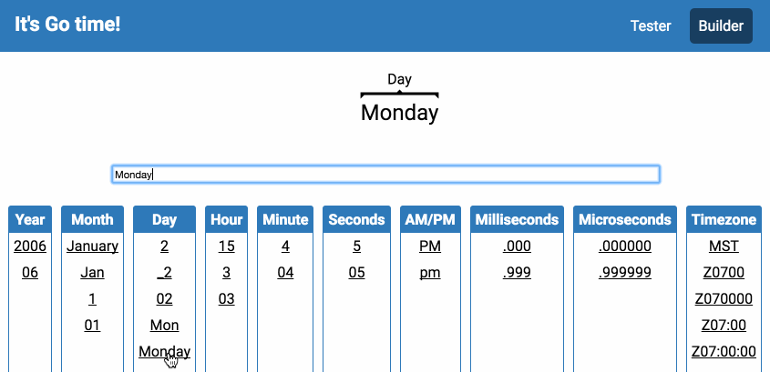

# gotime

The source for the [Go Time website](http://gotime.agardner.me/), a collection of tools for working with Golang's time format strings:  

- `index.html`: a tool for visualizing and explaining the various parts of a time format string.
- `parser.html`: a Javascript reimplementation of the `time.Parse` method, for quickly testing patterns client-side.
- `gotime.js`: a library for parsing time format strings and applying them.  
